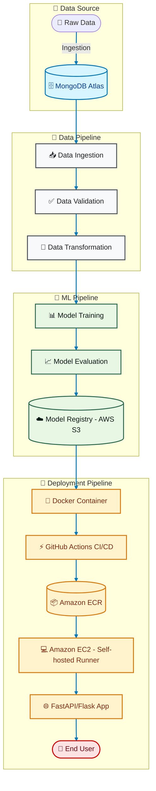

# InsureFlow-MLOps 🚀

A complete end-to-end **MLOps pipeline** project that covers data ingestion, validation, transformation, model training, evaluation, deployment, and CI/CD with AWS and GitHub Actions.  

---

## 📑 Index

- [Project Overview](#project-overview)
- [Architecture](#architecture)
- [Technologies & Tools](#technologies--tools)
- [Setup Instructions](#setup-instructions)
  - [Environment Setup](#1-environment-setup)
  - [MongoDB Setup](#2-mongodb-setup)
  - [Logging & Exception Handling](#3-logging--exception-handling)
  - [Data Ingestion](#4-data-ingestion)
  - [Data Validation & Transformation](#5-data-validation--transformation)
  - [Model Training & Evaluation](#6-model-training--evaluation)
  - [Prediction Pipeline](#7-prediction-pipeline)
  - [CI/CD with AWS](#8-cicd-with-aws)
- [Deployment](#deployment)
- [How to Run](#how-to-run)
- [Results](#results)
- [Future Enhancements](#future-enhancements)

---

## 📌 Project Overview

**InsureFlow-MLOps** is an insurance-focused machine learning project that implements modern MLOps practices.  
The project includes:
- Data ingestion from **MongoDB Atlas**
- Logging, exception handling, and EDA notebooks
- Data validation, transformation, and schema management
- Model training, evaluation, and pushing models to **AWS S3**
- CI/CD pipeline with **Docker, GitHub Actions, AWS EC2, and ECR**
- Deployment of a prediction service using **FastAPI/Flask**

---

## 🏗 Architecture



---

## ⚙️ Technologies & Tools

| Category              | Tools/Technologies Used |
|-----------------------|--------------------------|
| Programming Language  | Python 3.10 |
| Virtual Environment   | Conda |
| Package Management    | `requirements.txt`, `setup.py`, `pyproject.toml` |
| Database              | MongoDB Atlas |
| Cloud Storage         | AWS S3 |
| Compute               | AWS EC2 |
| Containerization      | Docker, DockerHub/ECR |
| CI/CD                 | GitHub Actions |
| Orchestration         | Self-hosted Runner (EC2) |
| Deployment            | FastAPI/Flask (served on EC2) |
| Logging & Monitoring  | Custom Logger |
| Notebooks             | Jupyter |
| Data Processing       | Pandas, NumPy, Scikit-learn |
| Model Training        | Scikit-learn |
| Infrastructure as Code| AWS CLI |

---

## ⚡ Setup Instructions

### 1️⃣ Environment Setup
```bash
conda create -n vehicle python=3.10 -y
conda activate vehicle
pip install -r requirements.txt
pip list
```

### 2️⃣ MongoDB Setup

1. Sign up on [MongoDB Atlas](https://www.mongodb.com/atlas).
2. Create a **project → cluster (M0)**.
3. Setup DB user credentials.
4. Allow network access (`0.0.0.0/0`).
5. Copy connection string and set environment variable:

```bash
# Linux / Mac
export MONGODB_URL="mongodb+srv://<username>:<password>@cluster0.mongodb.net/..."

# Windows PowerShell
$env:MONGODB_URL="mongodb+srv://<username>:<password>@cluster0.mongodb.net/..."

# Windows CMD
set MONGODB_URL=mongodb+srv://<username>:<password>@cluster0.mongodb.net/...
```

6. Verify connection with `mongoDB_demo.ipynb`.

---

### 3️⃣ Logging & Exception Handling

* Implemented `logger.py` and `exception.py`.
* Verified with `demo.py`.

---

### 4️⃣ Data Ingestion

* Variables defined in `constants/__init__.py`.
* MongoDB connection: `configuration/mongo_db_connections.py`.
* Fetch & transform data → Pandas DataFrame.
* Pipeline: `components/data_ingestion.py`.

---

### 5️⃣ Data Validation & Transformation

* Schema defined in `config/schema.yaml`.
* `utils/main_utils.py` for validations.
* Transformation pipelines added in `entity/estimator.py`.

---

### 6️⃣ Model Training & Evaluation

* Training pipeline defined in `entity/estimator.py`.
* Evaluation threshold:

```python
MODEL_EVALUATION_CHANGED_THRESHOLD_SCORE = 0.02
```

* Models pushed to **AWS S3 bucket**.

---

### 7️⃣ Prediction Pipeline

* `app.py` for REST API.
* `templates/` and `static/` for UI.

Run locally:

```bash
python app.py
```

---

### 8️⃣ CI/CD with AWS

1. **Dockerfile + .dockerignore** setup.
2. AWS Services:

   * IAM user with `AdministratorAccess`
   * S3 bucket: `my-model-mlopsproj`
   * ECR repo: `vehicleproj`
   * EC2 instance (Ubuntu 24.04, T2.medium)
3. Setup **Self-hosted runner** on EC2.
4. Configure GitHub Secrets:

   * `AWS_ACCESS_KEY_ID`
   * `AWS_SECRET_ACCESS_KEY`
   * `AWS_DEFAULT_REGION`
   * `ECR_REPO`
5. GitHub Actions → auto builds & deploys.

---

## 🌍 Deployment

* Application deployed on **EC2**.
* Open in browser:

```
http://<EC2-PUBLIC-IP>:5080
```

---

## ▶️ How to Run

* **Train model:**

  ```
  http://<EC2-PUBLIC-IP>:5080/training
  ```
* **Predict:**

  ```
  http://<EC2-PUBLIC-IP>:5080/predict
  ```

---

## 📊 Results

* Data successfully ingested into MongoDB.
* Models trained & pushed to AWS S3.
* CI/CD pipeline automates deployment.
* Web service live on EC2.

---

## 🔮 Future Enhancements

* Add monitoring with Prometheus & Grafana.
* Model registry integration with MLflow.
* Expand CI/CD with Kubernetes.
* Automated retraining on new data.

---